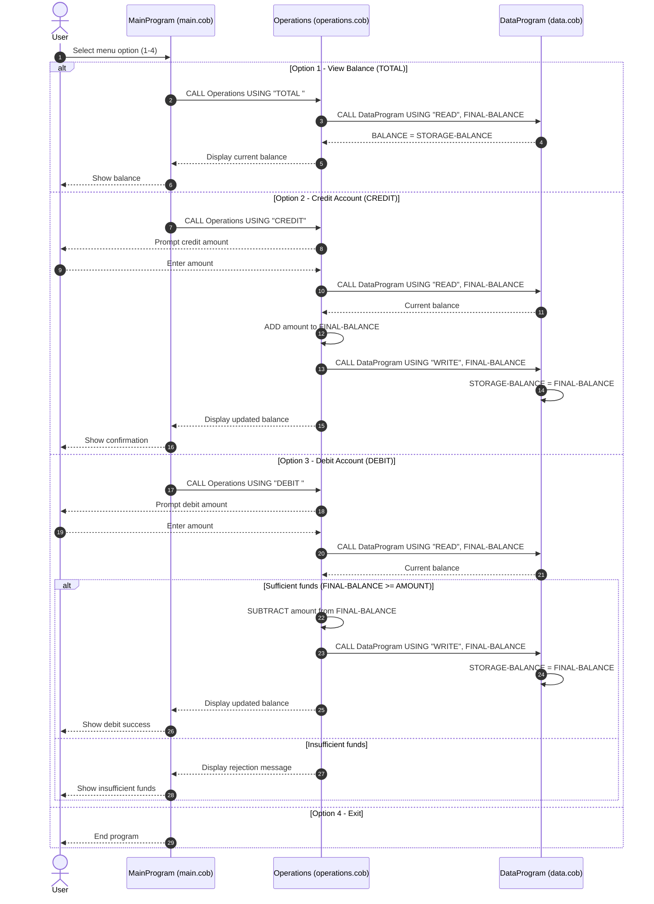

# COBOL Student Account System Documentation

## Overview
This project implements a simple student account management flow in COBOL. The system allows a user to:
- View current balance
- Credit funds to the account
- Debit funds from the account (if funds are sufficient)

The solution is split into three COBOL programs under [src/cobol](../src/cobol):
- `main.cob`
- `operations.cob`
- `data.cob`

## File Purposes

### `main.cob` (Program: `MainProgram`)
Purpose:
- User-facing entry point and menu loop.

Key responsibilities:
- Displays account menu options.
- Captures user choice (`1` to `4`).
- Routes requests by calling `Operations` with operation codes:
  - `TOTAL ` for balance inquiry
  - `CREDIT` for adding funds
  - `DEBIT ` for subtracting funds
- Handles invalid menu inputs.
- Exits the loop when option `4` is selected.

### `operations.cob` (Program: `Operations`)
Purpose:
- Business operation coordinator for account actions.

Key responsibilities:
- Receives an operation type via linkage (`PASSED-OPERATION`).
- For `TOTAL `:
  - Calls `DataProgram` with `READ`.
  - Displays current balance.
- For `CREDIT`:
  - Prompts for credit amount.
  - Reads current balance from `DataProgram`.
  - Adds amount to balance.
  - Writes updated balance back via `WRITE`.
- For `DEBIT `:
  - Prompts for debit amount.
  - Reads current balance from `DataProgram`.
  - Validates available funds.
  - Subtracts and writes updated balance when allowed.
  - Displays insufficient funds message otherwise.

### `data.cob` (Program: `DataProgram`)
Purpose:
- Shared balance holder and read/write service.

Key responsibilities:
- Maintains `STORAGE-BALANCE` (initialized to `1000.00`).
- Exposes two operations through linkage:
  - `READ`: copies internal balance into passed `BALANCE`.
  - `WRITE`: updates internal balance from passed `BALANCE`.

## Key Functional Flow
1. User selects an option in `MainProgram`.
2. `MainProgram` calls `Operations` with a 6-character operation code.
3. `Operations` calls `DataProgram` to read/write balance as needed.
4. Control returns to menu until the user exits.

## Business Rules for Student Accounts
- Initial account balance is `1000.00`.
- A credit operation increases the account balance by the entered amount.
- A debit operation is allowed only when `balance >= debit amount`.
- If debit amount exceeds available funds, transaction is rejected and balance remains unchanged.
- Balance inquiry does not modify account state.
- Operation identifiers are fixed-width and case-sensitive (notably `TOTAL ` and `DEBIT ` include a trailing space).

## Notes and Limitations
- Balance is kept in program memory (`WORKING-STORAGE`) only.
- Data is not persisted to disk or database.
- Input validation for numeric format and non-negative amounts is minimal and could be strengthened in future modernization work.

## Sequence Diagram (Data Flow)

